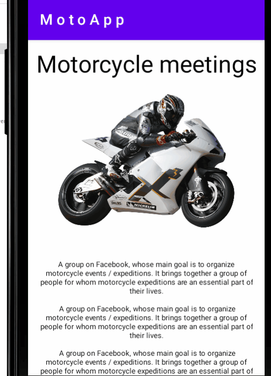
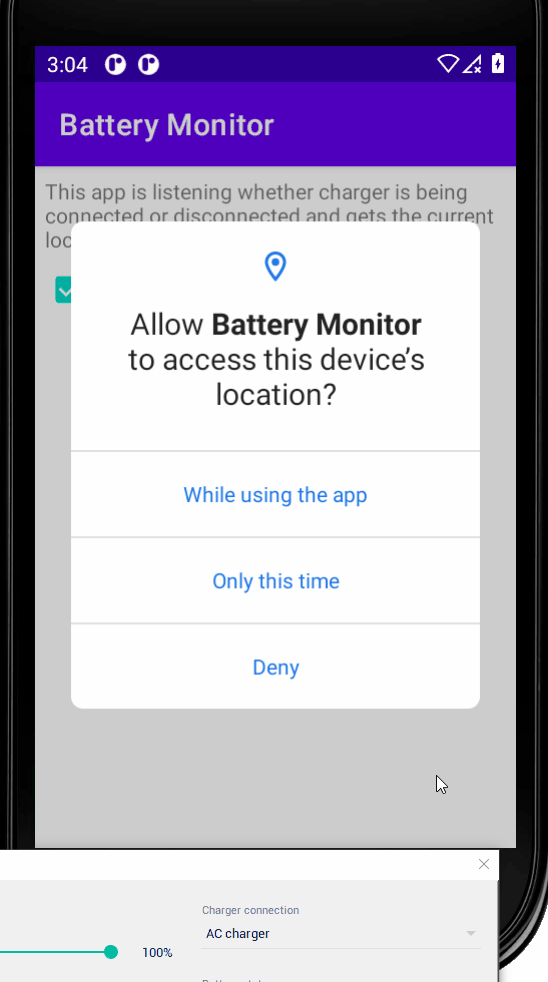

# Lab01

Lab01 - prosty layout i dwa tłumaczenia tekstu: pl i en.

# Labb02

Lab02 - komunikacja między dwoma widokami.

# Lab03

Lab03 - Wykrywanie podłączonej ładowarki, toast, odczyt aktualnej lokalizacji GPS
